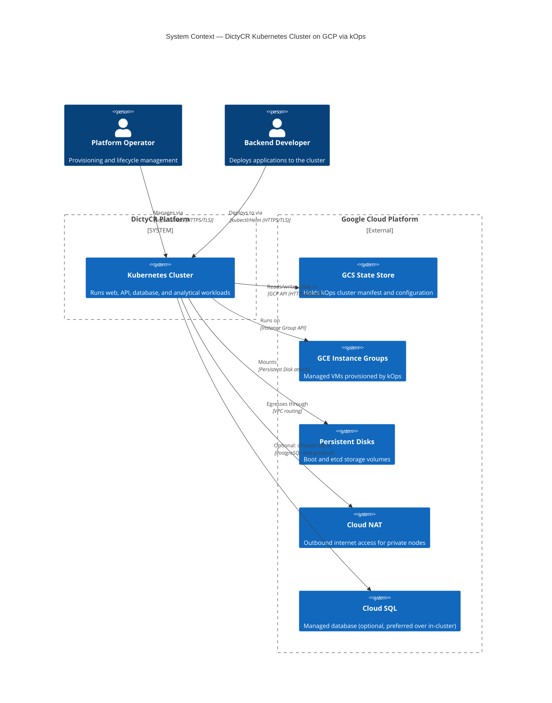
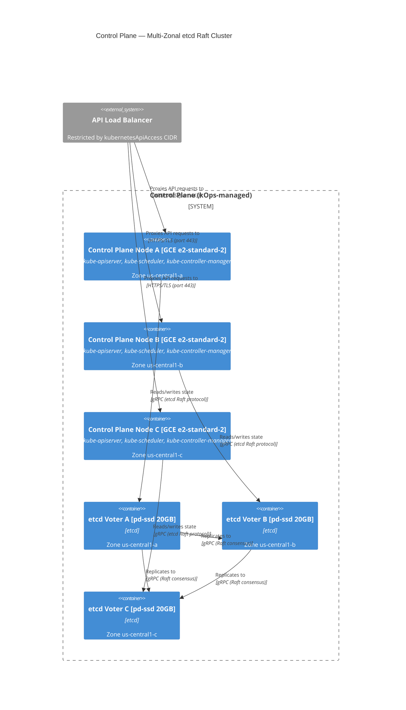
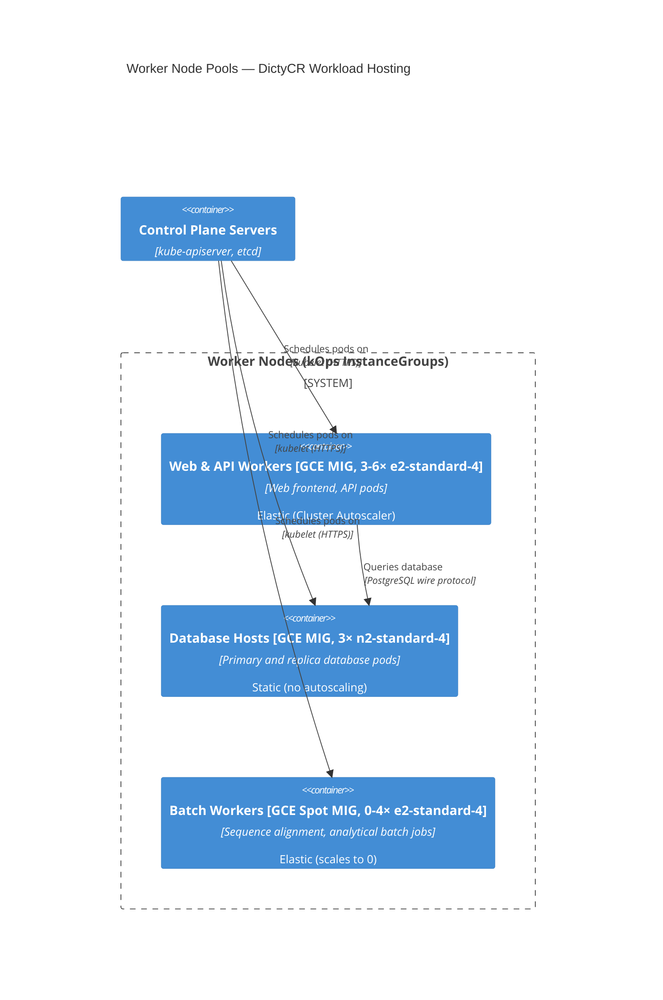
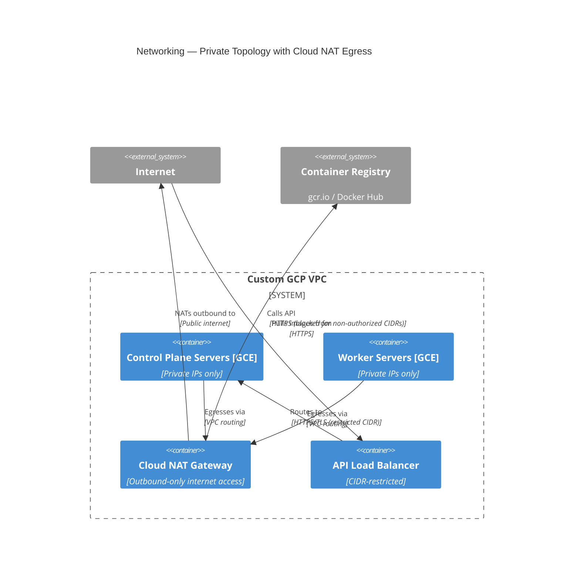

# Kops on GCP — Architecture & Operations

This document covers the kops-specific architecture, lifecycle, and GCP quirks for
the DictyCR Kubernetes deployment. It is extracted from the broader [GCP cluster
architecture proposal](kops-gcp-architecture.md) and focuses exclusively on what
kops controls: cluster versioning, control-plane sizing, node-pool topology, GCP
networking and identity, and the deployment workflow.

**C4 Level:** L2 (Container) — intended for DevOps engineers operating the
DictyCR cluster and backend developers who need to understand deployment
topology. For step-by-step provisioning commands, see the [kops setup
runbook](kops-setup-draft.md).

For generic Kubernetes concerns (HPA/VPA, database engine choice, workload
sizing analysis), see the full architecture proposal.

## Table of Contents
- [Overview](#overview)
- [Requirements & Goals](#requirements--goals)
- [1. System Context (C4 L1)](#1-system-context-c4-l1)
- [2. Container Architecture (C4 L2)](#2-container-architecture-c4-l2)
  - [2.1 Control Plane](#21-control-plane)
  - [2.2 Worker Node Pools](#22-worker-node-pools)
    - [2.2.1 Stateless Web/API Pool](#221-stateless-webapi-pool)
    - [2.2.2 Stateful/Database Pool](#222-statefuldatabase-pool)
    - [2.2.3 Analytical/Batch Pool (Spot)](#223-analyticalbatch-pool-spot)
  - [2.3 etcd Storage](#23-etcd-storage)
- [3. Cross-Cutting Concepts](#3-cross-cutting-concepts)
  - [3.1 Networking & Security Posture](#31-networking--security-posture)
  - [3.2 Identity & Access](#32-identity--access)
  - [3.3 OS Image Compatibility](#33-os-image-compatibility)
- [4. Architecture Decisions](#4-architecture-decisions)
  - [ADR-001: Version Strategy](#adr-001-version-strategy)
  - [ADR-002: Control Plane Topology](#adr-002-control-plane-topology)
  - [ADR-003: Node Pool Layout](#adr-003-node-pool-layout)
  - [ADR-004: Networking Model](#adr-004-networking-model)
- [5. Technical Risks](#5-technical-risks)
- [6. HA vs Cost-Optimized Comparison](#6-ha-vs-cost-optimized-comparison)
- [7. Deployment Specification](#7-deployment-specification)
  - [7.1 Initialize Environment Variables](#71-initialize-environment-variables)
  - [7.2 Create Cluster Configuration Template](#72-create-cluster-configuration-template)
  - [7.3 Edit Cluster Configuration](#73-edit-cluster-configuration)
  - [7.4 Provision Infrastructure](#74-provision-infrastructure)

## Requirements & Goals

**Business goals:**

- Maintain DictyCR availability during single-zone GCP failures.
- Reduce compute cost for batch workloads (sequence alignment, data
  processing) without impacting production traffic.
- Support a migration from EOL Kubernetes v1.28 to a supported upstream
  version with minimal operational risk.

**Technical constraints:**

- Must upgrade through 7 sequential Kubernetes minor versions; version
  skipping is not supported by upstream.
- etcd fsync latency must stay under thresholds that trigger leader-election
  timeouts; this constrains disk type and volume sizing.
- kOps relies on `cloud-init` to bootstrap cluster nodes — only COS and Ubuntu
  images are compatible on GCP.

**Non-functional requirements:**

- **Availability:** Survive single-zone failure (control plane + worker pools).
- **Security:** Defense-in-depth — private topology, Cloud NAT for egress,
  CIDR-restricted API access, separate administrative and node identities.
- **Cost efficiency:** Spot VMs for interruptible batch workloads; elastic
  scaling for stateless pools.

## Overview

Kops is the cluster operations tool that provisions, upgrades, and manages the
lifecycle of the DictyCR Kubernetes cluster on GCP. It is responsible for:

- **Cluster definition** — a declarative manifest stored in a GCS state bucket
  that describes every resource: control-plane and worker nodes, disks, load
  balancers, networking, and IAM bindings.
- **Provisioning** — turning that manifest into real GCE instances, persistent
  disks, forwarding rules, and firewall rules via the GCP API.
- **Lifecycle management** — rolling control-plane upgrades, worker-node
  rotation, and API deprecation handling across Kubernetes minor versions.

Kops does **not** manage: application deployments (Helm/Pulumi), database
engines (Cloud SQL or in-cluster operators), pod autoscaling (HPA/VPA), or
workload identity inside the cluster (Workload Identity Federation). Those
concerns live in the broader architecture proposal.

## 1. System Context (C4 L1)



## 2. Container Architecture (C4 L2)

### 2.1 Control Plane

The control plane runs the Kubernetes API server, scheduler, controller
manager, and etcd across three failure domains for Raft quorum.



**Sizing:**

| Parameter | Value | Rationale |
|-----------|-------|-----------|
| Node count | 3 | Required for etcd Raft quorum; a 2-node plane cannot survive a 1-node loss |
| Machine type | `e2-standard-2` or `n2-standard-2` | 2 vCPUs, 8 GB RAM. `n2` offers more predictable performance |
| Boot disk | 64 GB `pd-balanced` | Separate from etcd volumes; solid-state boot at lower cost than `pd-ssd` |

### 2.2 Worker Node Pools

Kops provisions worker nodes through GCE Managed Instance Groups (MIGs). Each
node pool maps to a kops InstanceGroup — you define the machine type, disk
size, zone distribution, and scaling bounds in the manifest, and kops
translates those into GCE resources.



#### 2.2.1 Stateless Web/API Pool

- **Instance Family:** `e2-standard-4` (4 vCPUs, 16 GB RAM).
- **Elasticity:** Elastic, spanned across 3 zones. kOps manifest configures
  `minSize: 3` and `maxSize: 6`. Three nodes ensure that if an entire zone
  experiences a temporary outage, the remaining two zones can keep web traffic
  reachable.
- **Boot Disk:** 100 GB `pd-balanced`.

#### 2.2.2 Stateful/Database Pool

- **Instance Family:** `n2-standard-4` (4 vCPUs, 16 GB RAM) or
  `n2-highmem-4` (4 vCPUs, 32 GB RAM) depending on working set requirements.
  The `N2` series is designed for more predictable performance, critical for
  stable database transaction processing.
- **Elasticity:** Static. Elastic autoscaling is highly discouraged for
  stateful relational databases — rapid scale-down events can interrupt active
  TCP connections, disrupt writes, and cause replica synchronization issues.
- **Boot Disk:** 100 GB `pd-balanced`. Database data resides on separate
  Persistent Volumes, not the boot disk.

#### 2.2.3 Analytical/Batch Pool (Spot)

- **Instance Family:** `e2-standard-4` running on **Spot VMs** (formerly
  Preemptible VMs).
- **Elasticity:** Elastic (0 to 4 nodes). Scales to 0 when no jobs are active
  to eliminate idle compute costs.
- **Rationale:** GCP Spot VMs offer up to a **91% discount** compared to
  standard instances (Source: [GCP Spot VM
  Docs](https://cloud.google.com/compute/docs/instances/spot)). Jobs must be
  stateless, idempotent, or robust to interruption. This pool must be isolated
  using Kubernetes **Node Taints** and **Tolerations** to ensure regular web
  pods do not run on Spot instances.

### 2.3 etcd Storage

`etcd` is extremely sensitive to disk write/fsync latency. Slow disk
performance causes leader-election timeouts, cascading into API server drops
and cluster failure.

- **Volume Isolation:** etcd-main and etcd-events reside on dedicated GCP
  Persistent Disks, separate from the OS boot disk. kOps handles this
  separation automatically when `volumeType` is configured in the manifest.
- **Disk Type:** `pd-ssd` (SSD Persistent Disk) is the recommended choice.
  `pd-ssd` offers lower latency and higher baseline IOPS than `pd-balanced`.
- **Capacity:** 20 GB to 50 GB per etcd volume. GCP Persistent Disk
  performance (IOPS and throughput) scales linearly with provisioned
  capacity — extremely small disks (e.g., 10 GB) may be severely throttled.
  Sizing must satisfy etcd's target write/fsync latencies under simulated peak
  loads.

**Manifest fields** (via `kops edit cluster`):

| Field Path | Value |
|-------------|-------|
| `spec.etcdClusters[0].etcdMembers[*].volumeType` | `pd-ssd` |
| `spec.etcdClusters[1].etcdMembers[*].volumeType` | `pd-ssd` |

## 3. Cross-Cutting Concepts

### 3.1 Networking & Security Posture

The cluster operates with a defense-in-depth network model:



- **Custom Mode VPC** — avoids CIDR collisions with auto-mode networks and
  keeps IP subnets segregated.
- **Private Topology** — both control plane and worker nodes use private-only
  GCP IP addresses (`spec.topology.masters: private`, `spec.topology.nodes:
  private`), preventing direct internet-based attacks.
- **Cloud NAT** — provisions an outbound gateway so private nodes can fetch
  container images and OS security updates without being exposed to incoming
  traffic.
- **CNI:** Cilium (set via `--networking=cilium`) for advanced network policy
  enforcement.
- **API Load Balancer Security** — restricts public API access to specific
  administrative CIDRs via `spec.kubernetesApiAccess`. Leaving the cluster API
  open to `0.0.0.0/0` is a severe security risk.

### 3.2 Identity & Access

Administrative and node workload identities are separated:

- **Administrative Identity:** The user or CI/CD runner executing `kops`
  commands requires read/write IAM permissions on the GCS state bucket.
- **Node Workload Identity:** Worker and control-plane nodes run under
  restricted, least-privileged Google Cloud Service Accounts assigned to their
  InstanceGroups. The node service accounts should have the minimum bucket
  permissions documented for the selected kOps release.

```yaml
spec:
  cloudProvider:
    gce:
      serviceAccount: "kops-nodes-sa@<project>.iam.gserviceaccount.com"
```

**GCS State Store Hardening:**

- **Uniform Bucket-Level Access (UBLA):** Consistent IAM across all objects.
- **Public Access Prevention (PAP):** Blocks public access.
- **Object Versioning:** Enabled (`gsutil versioning set on gs://...`) to
  protect against accidental state corruption or deletion.
- **Retention Policies:** Lifecycle Management rules to clean up or archive old
  state versions.
- **Encryption:** Encryption at rest enabled; use Customer-Managed Encryption
  Keys (CMEK) if compliance requires it.

### 3.3 OS Image Compatibility

- **GCE Support Status:** GCP is officially supported in kOps alongside AWS
  (Source: [kOps Supported
  Providers](https://kops.sigs.k8s.io/)). The legacy feature flag
  `KOPS_FEATURE_FLAGS=AlphaAllowGCE` is obsolete and no longer required in
  modern stable versions (v1.35.x).
- **Cloud-Init Gotcha:** Do not use standard GCP RHEL or Rocky Linux images.
  Default GCP RHEL/Rocky images lack `cloud-init`, which kOps relies on to
  boot `nodeup` (the engine that configures Kubernetes components on VM boot).
  Nodes will boot successfully but hang forever and never register with the
  cluster.
- **Remediation:** Use Google **Container-Optimized OS (COS)** or **Ubuntu
  Server**, which have full, native, out-of-the-box support in kOps.

## 4. Architecture Decisions

### ADR-001: Version Strategy

In the context of an existing kOps v1.29.2 deployment managing Kubernetes
v1.28.8 (both EOL upstream), facing unpatched security vulnerabilities and
missing modern cloud-provider driver compatibility, we decided for upgrading to
Kubernetes v1.35.x managed by kOps v1.35.x, to achieve full upstream support
and access to the unified `kops reconcile cluster` workflow, accepting that
the upgrade requires seven sequential minor-version hops with API deprecation
audits at each step.

| Option | Benefit | Cost | Verdict |
|--------|---------|------|---------|
| **Kubernetes v1.35.x + kOps v1.35.x** | Supported upstream; unified `reconcile` command; modern CSI drivers | 7-step sequential upgrade; API deprecation audits required | **Chosen** |
| Stay on v1.28/v1.29 | No migration effort | EOL — unpatched CVEs; no upstream support; GCP driver incompatibilities | Rejected: security risk |
| Jump to GKE instead | Managed control plane; no kOps overhead | Platform migration; vendor lock-in; different operational model | Deferred to v2 |

**Upgrade path:**

1. Sequential minor-by-minor: 1.28 → 1.29 → 1.30 → 1.31 → 1.32 → 1.33 →
   1.34 → 1.35. Skipping versions is not supported.
2. Audit deployment manifests and Helm charts at each step for deprecated APIs.
3. From kOps 1.31+, use `kops reconcile cluster` (replaces `kops update
   cluster --yes` + `kops rolling-update cluster --yes`).
4. Validate the full sequence in an identical staging environment first.

### ADR-002: Control Plane Topology

In the context of deploying the DictyCR control plane on GCP, facing the
requirement for high availability and `etcd` Raft consensus, we decided for
three control-plane nodes across three GCP zones with dedicated `pd-ssd`
etcd volumes, to achieve fault tolerance against single-zone failures and
stable etcd write latency, accepting increased compute cost (~$200/month extra
vs a single-node control plane).

| Option | Benefit | Cost | Verdict |
|--------|---------|------|---------|
| **3 nodes, 3 zones, pd-ssd etcd** | Survives single-zone failure; low fsync latency | 3× control-plane cost; configuration complexity | **Chosen** |
| 1 node, single zone | Lowest cost | Single point of failure for entire cluster API | Rejected: unacceptable in production |
| 2 nodes, 2 zones | Lower cost than 3 | Cannot survive 1-node loss — quorum ((N/2)+1) = 2 is instantly lost | Rejected: false sense of HA |

### ADR-003: Node Pool Layout

In the context of hosting DictyCR's dual-nature workload (web/API traffic plus
database-heavy analytical operations), facing unpredictable traffic bursts from
scientific publications and batch sequence-alignment jobs, we decided for a
three-pool architecture (elastic stateless, static stateful, elastic spot
batch), to achieve cost efficiency through independent scaling while protecting
database stability, accepting increased kOps InstanceGroup configuration
complexity.

| Option | Benefit | Cost | Verdict |
|--------|---------|------|---------|
| **Three-pool: elastic stateless + static stateful + spot batch** | Independent scaling; DB stability; batch cost savings | 3 InstanceGroups to configure and monitor | **Chosen** |
| Single consolidated pool | Simpler configuration | Stateful DB disrupted by autoscale events; batch/Spot cannot be isolated | Rejected: operational risk to DB |
| Two-pool: elastic stateless + static stateful | Simpler than three-pool | No Spot cost savings for batch workloads | Acceptable interim state |

### ADR-004: Networking Model

In the context of deploying kOps on GCP with defense-in-depth security
requirements, facing the risk of direct internet-based attacks on cluster
nodes, we decided for a Custom VPC with private topology, Cloud NAT for
egress, and CIDR-restricted API access, to achieve defense-in-depth network
isolation, accepting the operational overhead of managing NAT gateway
configuration and CIDR allow-lists.

| Option | Benefit | Cost | Verdict |
|--------|---------|------|---------|
| **Custom VPC + Private Topology + Cloud NAT + CIDR API** | Defense-in-depth; no public node IPs | NAT gateway cost; CIDR maintenance | **Chosen** |
| Public topology (no NAT) | Simpler; lower cost | Nodes exposed to internet attacks; unrestricted API access | Rejected: severe security risk |
| Auto-mode VPC | Automatic subnet provisioning | CIDR collisions; no subnet control; security posture degraded | Rejected: conflicts with private topology |

## 5. Technical Risks

| Risk | Likelihood | Impact | Mitigation |
|------|-----------|--------|------------|
| etcd fsync latency exceeds thresholds, causing leader-election timeouts | Medium | Critical — API server drops, cluster unreachable | Use `pd-ssd` with adequate provisioned IOPS; monitor etcd disk metrics; size volumes ≥20 GB to avoid GCP throttling |
| Single-zone failure while database is in-cluster (non-Cloud SQL) | Low | Critical — database downtime, possible data loss if quorum lost | Deploy with 3 replicas + pod anti-affinity across zones; use Cloud SQL as preferred option; test failover quarterly |
| Spot VM preemption during active batch job | High | Low — job interruption, data discarded | Jobs must be stateless/idempotent or checkpoint-tolerant; use Node Taints to prevent non-batch pods on Spot |
| API deprecation blocks upgrade mid-sequence | Medium | High — upgrade stalls, cluster stuck between versions | Audit manifests with `kubectl convert --validate` before each minor step; maintain staging cluster for dry-run |
| Stale kOps state in GCS (versioning disabled, no backups) | Low | Critical — cluster unrecoverable if state corrupt | Enable GCS versioning + lifecycle rules; practice state restore from backup |
| API server CIDR `0.0.0.0/0` exposure | Low (if configured correctly) | Critical — cluster fully controllable from internet | Enforce CIDR restriction in manifest; validate with `gcloud compute forwarding-rules describe` |
| Version skew between kubectl client and cluster >1 minor | Medium | Medium — `kubectl` commands produce unexpected errors or silent API mismatches | Pin `kubectl` version to match cluster minor version; use `asdf` to manage versions |

## 6. HA vs Cost-Optimized Comparison

Production cloud costs depend heavily on regional variables, exact database
configurations, NAT gateway egress volume, Persistent Disk capacity, and
network egress traffic. Model your actual workloads using the official [GCP
Pricing Calculator](https://cloud.google.com/products/calculator) instead of
relying on speculative estimates. Both designs below use private nodes, Cloud
NAT, and restricted API access:

| Architectural Component | Highly Available Plan (Recommended) | Cost-Optimized Plan |
|--------------------------|--------------------------------------|---------------------|
| **Control Plane Nodes** | **3 × `e2-standard-2`** (3 zones) | **3 × `e2-standard-2`** (Do not compromise control-plane HA) |
| **Worker Nodes** | **3-6 × `e2-standard-4`** (Stateless) + **3 × `n2-standard-4`** (Dedicated DB) + **0-4 Spot Nodes** (Batch) | **2-4 × `e2-standard-2`** (Consolidated pool for Web and DB) |
| **Database Tier** | Managed Cloud SQL with multi-zone HA | Self-hosted non-HA (single replica), zonal `pd-balanced` |
| **Network Security** | Custom VPC, Private Topology, Cloud NAT, restricted API CIDR | Custom VPC, Private Topology, Cloud NAT, restricted API CIDR |
| **Zone Failure Tolerance** | **High.** Redundancies in compute and database minimize downtime risk, though zonal failures may still cause brief pod/database failover. | **Low-to-Moderate.** Web app stays up, but database is non-HA and will experience downtime during a node or zonal outage, requiring manual restore or recovery. |

## 7. Deployment Specification

> **Why this section is included:** The `kops create cluster` template flags
> encode architectural decisions — topology, networking, sizing, and etcd
> storage — that directly materialize the ADRs in this document. The commands
> below show how the architecture translates to the provisioning layer. For
> the full step-by-step walkthrough (prerequisites, authentication,
> troubleshooting), see the [kops setup runbook](kops-setup-draft.md).

Deploying a highly available kOps cluster on GCP involves generating a cluster
template and then editing it to match your architecture.

### 7.1 Initialize Environment Variables

```bash
export PROJECT="your-gcp-project-id"
export KOPS_STATE_STORE="gs://dictycr-kops-state-store"
export NAME="dictycr-cluster.k8s.local"
```

### 7.2 Create Cluster Configuration Template

This command generates the cluster template in your GCS bucket without creating
actual resources. Modern kOps uses `--control-plane-count` and
`--control-plane-zones` (rather than deprecated `master` terminology) and
configures explicit boot disk sizes:

```bash
kops create cluster \
    --name=${NAME} \
    --state=${KOPS_STATE_STORE} \
    --project=${PROJECT} \
    --zones=us-central1-a,us-central1-b,us-central1-c \
    --control-plane-zones=us-central1-a,us-central1-b,us-central1-c \
    --node-count=3 \
    --node-size=e2-standard-4 \
    --control-plane-count=3 \
    --control-plane-size=e2-standard-2 \
    --control-plane-volume-size=64 \
    --node-volume-size=100 \
    --topology=private \
    --networking=cilium \
    --cloud=gce \
    --kubernetes-version=${KUBERNETES_VERSION}
```

**Expected output:** `Created cluster "dictycr-cluster.k8s.local"` — a
manifest is written to the state store but no VMs are provisioned yet.

### 7.3 Edit Cluster Configuration

After creating the template, tune the manifest for production:

```bash
kops edit cluster --name=${NAME} --state=${KOPS_STATE_STORE}
```

Adjust these manifest fields:

| Manifest Section | Field Path | Recommended Value |
|------------------|------------|-------------------|
| **GCP Project** | `spec.cloudProvider.gce.project` | `"your-gcp-project-id"` |
| **Service Account** | `spec.cloudProvider.gce.serviceAccount` | `"kops-nodes-sa@<project>.iam.gserviceaccount.com"` |
| **API Access** | `spec.kubernetesApiAccess` | `["your-administrative-cidr/32"]` |
| **CSI Driver** | `spec.cloudProvider.gce.pdCSIDriver.enabled` | `true` |
| **etcd Volumes (main)** | `spec.etcdClusters[0].etcdMembers[*].volumeType` | `pd-ssd` |
| **etcd Volumes (events)** | `spec.etcdClusters[1].etcdMembers[*].volumeType` | `pd-ssd` |

### 7.4 Provision Infrastructure

To build and reconcile the GCE instances, disks, load balancers, and network
routes (kOps v1.31+):

```bash
kops reconcile cluster --name=${NAME} --state=${KOPS_STATE_STORE} --yes
```

**Expected output (final lines):**
```
Cluster "dictycr-cluster.k8s.local" is ready
```

To verify the cluster health after creation:

```bash
kops validate cluster --name=${NAME} --state=${KOPS_STATE_STORE} --wait 10m
```

**Expected output:** A list of nodes all showing `Ready` status, followed by:
```
Your cluster dictycr-cluster.k8s.local is ready
```
