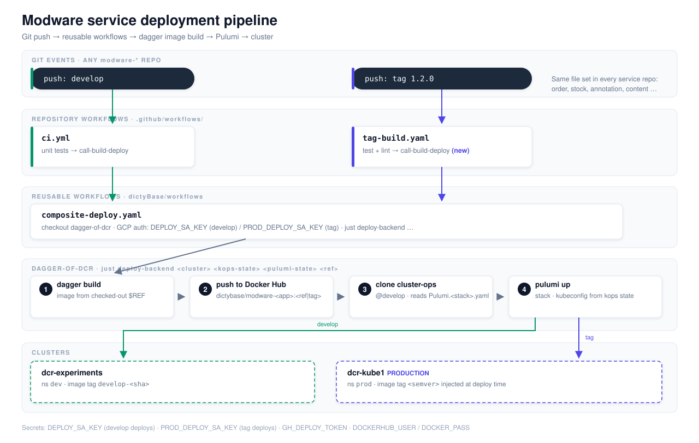

# Plan: Modware gRPC Service on Any Cluster

**Status**: Implemented (items 1–7, 9). Recipes live in `just_modules/cluster.justfile`, `pulumi.justfile`, `ci.justfile`; contract tests run in `just check` (test-cluster-registry, test-backend-scaffold, test-backend-prereqs, test-backend-bootstrap, test-ci-recipes, test-render-tag-deploy); docs are `docs/backend-service-deploy.md` + `docs/reference/backend/`. Item 8 (pin deploy path) is cross-repo and pending. Active runbook: [`../backend-service-deploy.md`](../backend-service-deploy.md). Reviewed by multi-model panel — see [Review disposition](#review-disposition).

**Runs after** the [upstream deploy refactor](upstream-deploy-refactor.md) (Phase 0): the dagger-of-dcr recipes take per-cluster tool versions, and the workflows pass them. Item 8 of this plan shrinks as a result.



## Table of Contents
- [Goal](#goal)
- [Non-goals](#non-goals)
- [Current state](#current-state)
- [Target state](#target-state)
- [Repository boundaries](#repository-boundaries)
- [Deliverable convention](#deliverable-convention)
- [Work items](#work-items)
  - [1. Cluster registry contract](#1-cluster-registry-contract)
  - [2. Stack scaffold recipe (new)](#2-stack-scaffold-recipe-new)
  - [3. Cluster prerequisites](#3-cluster-prerequisites)
  - [4. First deploy](#4-first-deploy)
  - [5. CI deploy credentials and variables (new)](#5-ci-deploy-credentials-and-variables-new)
  - [6. Tag workflow with the composite deploy (new)](#6-tag-workflow-with-the-composite-deploy-new)
  - [7. Backend program production fields](#7-backend-program-production-fields)
  - [8. Pin the deploy path for production](#8-pin-the-deploy-path-for-production)
  - [9. New cluster bootstrap checklist](#9-new-cluster-bootstrap-checklist)
- [Documentation map](#documentation-map)
- [Order of implementation](#order-of-implementation)
- [Acceptance](#acceptance)
- [Risks](#risks)
- [Review disposition](#review-disposition)

## Goal

Any modware gRPC service (order, stock, annotation, content) deploys to any kOps
cluster in this repo with **zero manual steps after the one-time setup**: merging to
a branch or pushing a tag builds the image and installs it in the mapped cluster.
Concrete first instance: **modware-order on dcr-kube1, installed on tag push**.

This plan is a writing plan: its output is **recipes plus the documentation that
teaches operators to use them**. No recipe ships without its guide section and
reference doc (see [Deliverable convention](#deliverable-convention)).

## Non-goals

- Do **not** change `Pulumi.experiments.yaml` or the develop→`experiments` deploy path — the lab stack stays frozen.
- Do **not** hand-edit live clusters with `kops edit` / `kubectl apply` — Git first, then recipes ([day-2 loop](../reference/kops/day2-operations.md)).
- Do **not** add a `stateless-web` pool requirement — services schedule on the default `nodes` pool.
- gRPC services stay **ClusterIP-only** — clients (graphql-server) are in-cluster. External ingress is a separate future plan.
- `internal/backend` changes are in scope only as item 7 — nothing else.

## Current state

| Piece | Today | Source |
|-------|-------|--------|
| Service program | `modware-order/main.go` → `internal/backend.Run` (Deployment **1 replica, no probes, no resource limits** + ClusterIP Service) | this repo |
| Stack config | `modware-order/Pulumi.experiments.yaml` — ns `dev`, port 9250, image `dictybase/modware-order:develop-<sha>`, ArangoDB Secret `backend` keys `user`/`password` | this repo |
| Develop push | `ci.yml` → test → `composite-deploy.yaml@develop` → stack `experiments`, cluster `vars.DEV_STAGING_CLUSTER` | `dictyBase/modware-order` |
| Dead workflow file | `staging-build.yaml` deploys a stack with **no real environment behind it** — deleted in item 6 | `dictyBase/modware-order` |
| Tag push | `tag-build.yaml` → `build-publish-image.yaml@develop` → publishes `dictybase/modware-order:<tag>` — **no deploy**, and the image build is redundant with `composite-deploy`'s own build+publish — deleted in item 6 | `dictyBase/modware-order` |
| Deploy mechanics | `composite-deploy.yaml` checks out `dagger-of-dcr@develop`, runs `just deploy-backend …` → dagger builds image from `$REF`, then `pulumi up` | `dictyBase/workflows` |
| **Image tag injection** | Verified: `pulumi-ops/dagger/main.go` runs `pulumi config set --path properties.image.tag <tag>` **at deploy time**, before `up`. Tag comes from the GitHub deployment payload (= pushed ref). The tag committed in `Pulumi.<stack>.yaml` is only the manual-bootstrap value — CI always overrides it | `dagger-of-dcr` |
| **cluster-ops ref in CI** | Verified: `pulumiOpsBranch = "develop"` is a **hardcoded constant** in `dagger-of-dcr` (`pulumi-ops/dagger/main.go:16`). Deploys always clone cluster-ops develop — pinning needs a code change there, not just config | `dagger-of-dcr` |
| Existing recipes | `just gcp-pulumi ensure-stack / new-stack / new-stack-from / set-config / set-secret / preview / update`, `just gcp-cluster bootstrap-bundle / create-cluster / apply-cluster` | this repo |
| Secrets | Org-level, verified with `gh secret list --org dictyBase`: `DEPLOY_SA_KEY` (dev deployer, all repos), `DEVENV_SA_KEY`, `STAGING_SA_KEY`, `GH_DEPLOY_TOKEN`, `DOCKERHUB_USER`, `DOCKER_PASS`. **`PROD_DEPLOY_SA_KEY` does not exist yet** | GitHub org |
| **SA key selection** | Verified: `composite-deploy.yaml` hardcodes `credentials_json: ${{ secrets.DEPLOY_SA_KEY }}`. Its `environment` input only labels the GitHub Deployment record — it does **not** select secrets. GitHub forbids job-level `environment:` on a caller job of a reusable workflow, so the caller cannot switch keys. Every deploy today uses `DEPLOY_SA_KEY` | `dictyBase/workflows` |
| Vars | `PULUMI_STATE_STORAGE`, `DEV_STAGING_CLUSTER`, `DEV_STAGING_KOPS_STATE_STORAGE` | GitHub org/repo |
| dcr-kube1 | kOps cluster, state `gs://kops-state-dcr-kube1/dcr-kube1-k8s.local`, project `dcr-kube1`, `nodes` pool `e2-standard-2` min 2 / max 3 | `config/kops/dcr-kube1/` |
| ArangoDB app DBs | `create-arangodb-databases/` Pulumi stack creates logical databases/users — reuse it for the order database | this repo |

## Target state

| Trigger | Image tag | Stack | Cluster | Namespace |
|---------|-----------|-------|---------|-----------|
| push `develop` | `develop-<sha>` | `experiments` | dcr-experiments | `dev` |
| push tag `X.Y.Z` | `X.Y.Z` (injected at deploy time) | `dcr-kube1` | dcr-kube1 | `prod` |

## Repository boundaries

This plan touches four repositories plus GitHub org settings. Only column
"cluster-ops" is in scope here; the rest is cross-repository work done as PRs in
those repos, fed by templates and recipes from this one.

| Work item | cluster-ops (this repo) | modware-order (or other service repo) | dictyBase/workflows | dagger-of-dcr | GitHub settings |
|-----------|------------------------|----------------------------------------|---------------------|---------------|-----------------|
| 1 registry contract | recipe + data file + reference doc | — | — | — | consumes names |
| 2 stack scaffold | new recipe + template + docs | — | — | — | — |
| 3 prerequisites | recipes (existing + new probes) + docs | — | — | — | — |
| 4 first deploy | new composite recipe + stack file commit + docs | — | — | — | — |
| 5 CI credentials/vars | key-source reuse-or-mint + preflight + publish recipes + reference docs | receives vars + secret access | — | — | org secret `PROD_DEPLOY_SA_KEY` written by the recipe |
| 6 tag workflow | template + render recipe + reference doc | **PR: rewrite `tag-build.yaml` (test+lint+composite) + delete `staging-build.yaml`** — manual merge there | **PR: select `PROD_DEPLOY_SA_KEY` when `environment == production`** — manual | — | secret written by item 5 recipes |
| 7 backend program fields | **PR in this repo** (`internal/backend` + `BackendConfig`) | — | — | — | — |
| 8 pin deploy path | re-render with `--workflow-ref` | caller ref PRs | **release/tag** — manual | **code change: make `pulumiOpsBranch` configurable** — manual | — |
| 9 new cluster | existing kOps recipes + guide section | — | — | — | vars via item 5 |

Org **secrets** are org-level only — no repo- or environment-scoped secrets in
this plan.

| Secret | Used by | Status |
|--------|---------|--------|
| `DEPLOY_SA_KEY` | develop deploys (dcr-experiments) | exists, unchanged |
| `PROD_DEPLOY_SA_KEY` | tag deploys (dcr-kube1) | **new — minted and published by item 5 recipes** (value = key of a dcr-kube1 deployer SA: minted via existing `gcp-sa` recipes or reused via `--sa-key`), visibility *selected repositories* |
| `GH_DEPLOY_TOKEN`, `DOCKERHUB_USER`, `DOCKER_PASS` | all deploys | exist, unchanged |

The full key lifecycle is recipes (item 5): **source the key → preflight it
→ publish it**. Publishing needs an org-admin `gh` token and the key material
on disk — no portal clicking. `secrets: inherit` passes both keys to
`composite-deploy`; the `environment` input decides which one it uses (item 6).

## Deliverable convention

Every work item ships three things together, in the same commit:

1. **Recipe** in the owning `just_modules/*.justfile` (`pulumi.justfile`,
   `cluster.justfile`, or a new `ci.justfile`), following the repo's existing
   recipe shape: usage comment, `[arg(...)]` declarations, `[no-cd]`,
   describe-then-create probes, fail-closed validation before any mutation
   ([infrastructure checklist](../../AGENTS.md)).
2. **Contract test** picked up by `just check` — the existing recipes-lint and
   contract-test harness (`internal/recipeslint`, ArangoDB contract tests are
   the pattern) must cover the new recipe's guard behavior: refuses overwrite,
   fails on missing registry entry, preflight lines precede mutation lines.
3. **Documentation** in the [STYLE](../STYLE.md) split:
   - one numbered **guide section** in the guide named in the
     [Documentation map](#documentation-map) — summary line, `→ [details]` link,
     one minimal bash block, nothing after the block;
   - one **reference doc** under `docs/reference/backend/` with *What It Does →
     Behavior → Flags* (Required / Default / Notes columns) + warnings;
   - TOC, Quick Reference, and cross-doc anchors updated in the same commit
     (docs-lint enforces the mechanical subset).

A work item is **not done** when the recipe works — it is done when an operator
who has never seen it can run it from the guide alone.

## Work items

### 1. Cluster registry contract

One source of truth per cluster for the values every deploy needs. kOps values
already live in `config/kops/<cluster>/` + `cluster-env`; this item adds the
CI-side values and a read path. **All values are data, including the Pulumi
state bucket and the stack's namespace** — nothing resolves from ambient env and
no stack→namespace table hides in recipe code.

**Recipe** — `just gcp-cluster registry-show --cluster <name>` *(new)*: parses
`config/clusters/<cluster>.yaml`, prints the values, fails on missing keys or a
missing file. Every recipe below calls this instead of re-deriving values.

**Data file** — `config/clusters/<cluster>.yaml` *(new, one per cluster)*:
```yaml
cluster: dcr-kube1
kops_state: gs://kops-state-dcr-kube1
gcp_project: dcr-kube1
kms_secrets_provider: gcpkms://projects/dcr-kube1/locations/us-central1/keyRings/dictycr/cryptoKeys/pulumi
pulumi_state: gs://<pulumi-state-bucket>   # canonical value, not an env reference
namespace: prod                            # stack namespace, consumed by scaffold
ci_env: PROD                               # prefix for GitHub var names
```
Adding a cluster = adding this file. Deliberately a plain file copy — **no
generator recipe** (single file, seven keys; a generator would be longer than
the file). The reference doc carries a copy-paste block with every key
explained, which is the automation substitute.

**Contract test** — `registry-show` fails on: missing file, missing key,
`pulumi_state` that is an env reference rather than a `gs://` URI.

**Docs** — reference `docs/reference/backend/cluster-registry.md`.

### 2. Stack scaffold recipe *(new)*

**Recipe** — `just gcp-pulumi scaffold-backend-stack --folder modware-order --stack dcr-kube1 --port 9250`:

1. Reads the registry (item 1) for the stack's cluster — namespace and KMS
   provider come from the file, not a hardcoded table.
2. Renders `modware-order/Pulumi.dcr-kube1.yaml` from
   `config/templates/backend-stack.yaml.tmpl` *(new file)*:
   ```yaml
   secretsprovider: {{ kms_secrets_provider }}
   encryptedkey: {{ encryptedkey }}        # from pulumi stack init, step 3
   config:
     modware-order:properties:
       appName: order
       arangodbSecret: { name: order, passkey: password, userkey: user }
       command: start-server
       image: { name: dictybase/modware-order, tag: bootstrap }
       namespace: prod
       port: 9250
   ```
3. Runs `pulumi stack init --secrets-provider <kms>` (existing `new-stack`
   mechanics) to produce `encryptedkey`, then writes the file.
4. **Describe-then-create**: fails if `Pulumi.<stack>.yaml` already exists —
   never overwrites operator-tuned config.
5. Prints `Next: just gcp-pulumi check-backend-prereqs …` (recipe output is
   documentation).

Derivation rules:

- `appName`, image name, and the config key prefix (`modware-order:`) come from `--folder`.
- `arangodbSecret.name` defaults to `appName` — **per-service Secret, not the
  shared `backend` name** (two services sharing one Secret share one credential;
  override with `--secret-name` when a service genuinely needs an existing one).
- `image.tag: bootstrap` is a placeholder. CI deploys **always override the tag
  at deploy time** (`pulumi config set --path properties.image.tag`, see Current
  state); the committed value is used only by the manual first deploy (item 4),
  which the operator sets to a real published tag before running. Contract test:
  scaffolded prod stacks never contain `:latest`.

**Contract test** — refuses overwrite; fails on unknown `--stack` (no registry
entry); rendered YAML parses and carries the stack's KMS provider; secret name
defaults to the app name.

**Docs** — reference `docs/reference/backend/scaffold-backend-stack.md`.

### 3. Cluster prerequisites

Per target cluster, before the first deploy. All steps are recipes; no manual
cluster touches.

1. **Namespace** — existing: `just gcp-pulumi update --folder namespace-bootstrap --stack dcr-kube1`. Doc: one guide line linking the existing Pulumi docs — no new reference doc.
2. **ArangoDB instance + app database + credentials Secret** —
   `just arangodb …` recipes install ArangoDB on `stateful-db`
   ([pool requirements](../reference/arangodb/pool-requirements.md)); the
   existing **`create-arangodb-databases`** stack creates the logical database
   and user for the service; the Secret (name = `arangodbSecret.name` from the
   stack config, keys `user`/`password`) is created alongside. The gate below
   checks **all three layers**: K8s Secret, database exists, credentials work.
3. **Deployer access** — `just gcp-cluster verify-deployer-access --cluster dcr-kube1 --sa-key <path>` *(new)*:
   exports a kubeconfig from the kOps state bucket exactly the way
   `composite-deploy` will (same code path as `create-cluster` post-steps), then
   probes `kubectl auth can-i update deployments -n prod` **and a KMS
   encrypt/decrypt round-trip on the registry's secrets-provider key** (stack
   operations fail cryptically without `roles/cloudkms.cryptoKeyEncrypterDecrypter`).
   Read-only probes; fails closed with the missing permission named.
4. **Prereq gate** — `just gcp-pulumi check-backend-prereqs --folder modware-order --stack dcr-kube1` *(new)*:
   composite probe — namespace exists; Secret exists with the configured
   `userkey`/`passkey`; **ArangoDB database named in the stack exists and
   accepts the credentials**; port value in range. Zero mutations; never prints
   Secret values (keys only); exits non-zero listing every missing prerequisite.
   Item 4 runs it first.

**Contract tests** — both probes make zero mutations; `check-backend-prereqs`
exit code is non-zero and names each failure when the namespace/Secret/database
is absent (test against a throwaway namespace).

**Docs** — reference `docs/reference/backend/prerequisites.md`.

### 4. First deploy

**Recipe** — `just gcp-pulumi bootstrap-service --folder modware-order --stack dcr-kube1` *(new
composite — name chosen because `bootstrap-backend` already means the Pulumi
state backend)*:

1. `check-backend-prereqs` (item 3) — aborts before any mutation. Preflight
   lines precede mutation lines; the contract test asserts the order.
2. `ensure-stack` (existing) — semantics pinned by the contract test: **fails
   if `Pulumi.<stack>.yaml` is absent from the repo**; selects or inits the
   state entry only; never creates a stack file. CI must never invent stacks.
3. `preview` then `update` (existing).
4. `kubectl rollout status deploy/order-api-server -n <ns>` **plus image
   verification**: assert the running pod's image tag equals the intended one
   (`kubectl get pod -o jsonpath='{.spec.containers[0].image}'`) — rollout
   status alone does not prove the right image.
5. Prints `Next: commit the stack file and push develop, then just ci sync-deploy-vars …`.

**Manual on purpose** — the git commit + push of the stack file stays human:
the commit message is an operator decision ([day-2 loop](../reference/kops/day2-operations.md)),
and CI clones cluster-ops `develop` at deploy time; an unpushed stack file
deploys nothing. The guide states this ordering with a bold line, not a recipe.

**Contract test** — prereq failure → zero mutation side effects (assert no
`pulumi up` ran); happy path runs steps in the fixed order above.

**Docs** — reference `docs/reference/backend/bootstrap-service.md`.

### 5. CI deploy credentials and variables *(new)*

The deployer key is a GCP service-account key JSON. Three recipes in a new
group file `just_modules/ci.justfile`, in the order an operator runs them —
**source the key → preflight it → publish it → set the vars**.

**5a. Key source — reuse or mint.** Two supported paths, operator's choice:

- **Reuse** — pass an existing key from cluster management with `--sa-key <path>`
  in the recipes below. Cheapest, but only correct if that SA's roles are
  exactly the deployer set (below) and nothing broader.
- **Mint a dedicated deployer** — existing `gcp-sa` recipes, no new code:
  ```bash
  just gcp-sa create-sa --project dcr-kube1 --sa-name deployer \
    --roles-file gcs-files/roles-permissions/deployer-roles.txt
  just gcp-sa create-sa-key --project dcr-kube1 --sa-name deployer \
    --key-file config/keys/deployer-dcr-kube1.json   # gitignored
  ```
  Only new artifact: `deployer-roles.txt` — the exact roles deploys need:
  kops state bucket read (kubeconfig export), Pulumi state bucket read/write,
  `roles/cloudkms.cryptoKeyEncrypterDecrypter` on the registry's KMS key.
  Dedicated SA is the default recommendation: separate audit trail, revocable
  without touching cluster management.

**5b. Pre-flight — `just ci check-deploy-credentials --cluster dcr-kube1 --sa-key <path>`** *(new)*:
read-only, zero mutations, fails closed listing every failure:

1. Key file parses as GCP SA JSON; its `project_id` equals the registry's
   `gcp_project` (a dev key against a prod registry fails here).
2. SA carries every role in `deployer-roles.txt` (IAM policy describe).
3. Kubeconfig export from the kops state bucket works (reuses the
   `verify-deployer-access` code path — item 3).
4. KMS encrypt/decrypt round-trip on the registry's secrets-provider key.
5. Never prints key material or secret values.

**5c. Publish — `just ci set-deploy-secret --cluster dcr-kube1 --sa-key <path> --repo dictyBase/modware-order [--repo …]`** *(new)*:

1. `gh secret set PROD_DEPLOY_SA_KEY --org dictyBase --visibility selected
   --repos <repo-ids> < <sa-key>` — creates or overwrites (idempotent upsert)
   and sets repo visibility in one call.
2. Refuses if `--sa-key` is missing or unreadable; never echoes the key.
3. Warns that the key file on disk is secret material: must stay gitignored,
   delete after publish (`rm` hint in output).
4. Fails loudly if `gh` auth lacks org-admin — the cross-repo authority
   boundary (see [Repository boundaries](#repository-boundaries)).

**5d. Variables — `just ci sync-deploy-vars --cluster dcr-kube1 --repo … [--repo …]`** *(new)*:

1. Reads the registry entry → `ci_env: PROD` → var names `PROD_CLUSTER`,
   `PROD_KOPS_STATE_STORAGE`.
2. `gh variable set …` per `--repo`; idempotent; prints before/after values.
3. Verifies `PROD_DEPLOY_SA_KEY` is visible to each repo
   (`gh api orgs/dictyBase/actions/secrets/PROD_DEPLOY_SA_KEY/repositories`)
   — if not, prints the exact `set-deploy-secret` command to fix it.
4. Verifies org var `PULUMI_STATE_STORAGE` is visible to the repo; warns if not.

**Docs note** — the reference doc states the minimum `gh` token scopes
(org Actions secrets+variables write for the org recipes; repo admin for
vars) so operators do not run them with an overscoped token.

**Contract tests** — `check-deploy-credentials`: wrong project / missing role /
unreadable key each fail non-zero naming the failure, zero mutations;
`set-deploy-secret`: upsert call carries `--visibility selected` and the repo
list; `sync-deploy-vars`: var names derived from `ci_env` (no hardcoding);
missing registry entry → non-zero; `gh` failure propagates with the repo named.

**Docs** — reference `docs/reference/backend/ci-credentials.md` (5a–5c: key
lifecycle, role file, preflight failures) and
`docs/reference/backend/ci-variables.md` (5d).

### 6. Tag workflow with the composite deploy *(new)*

`tag-build.yaml` stays its own file with its own trigger — but it stops being a
special case: **same job shape as `ci.yml`** (test, lint, then the composite),
routed to production. The old `build-publish-image` call is dropped —
`composite-deploy` builds and publishes the image itself, so keeping it would
build every tag twice. `ci.yml` is untouched.

**Recipe** — `just ci render-tag-deploy --app order --project modware-order --stack dcr-kube1 --out tag-build.yaml` *(new)*:

1. Reads the registry entry for the stack → prod var names from `ci_env`.
2. Renders the complete `tag-build.yaml` from
   `config/templates/tag-build-deploy.yaml.tmpl` *(new file)*:
   ```yaml
   name: Tag Build
   on:
     push:
       tags: ['*']
   concurrency:
     group: deploy-${{ github.repository }}-${{ github.ref_name }}
     cancel-in-progress: false
   jobs:
     test: ...            # same job as ci.yml
     lint: ...            # golangci-lint, mirrors lint.yml
     call-build-deploy:
       needs: [test, lint]
       uses: dictyBase/workflows/.github/workflows/composite-deploy.yaml@develop
       secrets: inherit
       with:
         app: order
         project: modware-order
         stack: dcr-kube1
         repository: ${{ github.repository }}
         ref: ${{ github.ref_name }}      # tag = image tag, injected at deploy time
         dockerfile: build/package/Dockerfile
         docker_image: modware-order
         cluster: ${{ vars.PROD_CLUSTER }}
         cluster_state_storage: ${{ vars.PROD_KOPS_STATE_STORAGE }}
         environment: production          # input: selects PROD_DEPLOY_SA_KEY (see below)
   ```
   Tag deploys pass the same test + lint gate as develop — no untested commit
   reaches dcr-kube1. The `concurrency` group serializes runs per (repo, tag).
3. The same PR deletes `staging-build.yaml` — no real environment behind it.
4. Writes to `--out`; never edits the service repo in place. Accepts
   `--workflow-ref <ref>` so the output is pin-ready for item 8.
5. Future cluster: render another file per (trigger, cluster) — one file per
   mapping, the general pattern.

**Cross-repo prerequisite — key selection in `dictyBase/workflows`.** Today
`composite-deploy.yaml` always authenticates with `DEPLOY_SA_KEY`. One-line PR
there, in the `google-github-actions/auth` step:
```yaml
credentials_json: ${{ inputs.environment == 'production' && secrets.PROD_DEPLOY_SA_KEY || secrets.DEPLOY_SA_KEY }}
```
`ci.yml` passes no `environment` input → composite default `development` → dev
key, unchanged. Without this PR, a tag deploy would authenticate to dcr-kube1
with the dev key and fail.

The PR, review, and `gh pr merge --rebase` in modware-order are cross-repo
manual steps (pattern: modware-order PR #262). Rollback = `gh run rerun
<run-id>` on the previous tag's run: same ref, same image, same stack — no git
surgery, no stack file edit.

**Contract test** — rendered YAML parses; trigger is tags only; deploy job
`needs: [test, lint]`; static `with:` values match the registry entry for the
given `--stack`; input-drift guard: every `with:` key exists in
`composite-deploy.yaml`'s `workflow_call.inputs` at the pinned ref (fetches the
workflow file at `--workflow-ref`, compares key sets) — a caller/reusable
workflow mismatch fails at render time, not in a prod deploy run; zero
occurrences of `staging` in the rendered file.

**Docs** — reference `docs/reference/backend/render-deploy-workflows.md`.

### 7. Backend program production fields### 7. Backend program production fields

`internal/backend` today: 1 replica, no probes, no resource requests/limits.
Acceptable for `experiments`; not for prod. This item reopens the non-goal
narrowly — add three **optional** `BackendConfig` fields consumed from stack
config, defaulting to current behavior (lab stacks unchanged):

| Field | Default | dcr-kube1 value |
|-------|---------|-----------------|
| `replicas` | 1 | 2 |
| `resources` (requests/limits) | none | `100m/128Mi` req, `500m/512Mi` lim |
| `grpcHealthProbe` (readiness + liveness via gRPC health protocol) | off | on |

**Exposure stays ClusterIP** (non-goal): the in-cluster client is
graphql-server at `order-api-server.prod.svc.cluster.local:9250`. Acceptance
includes an in-cluster gRPC connectivity check (`grpcurl` from a throwaway pod),
not just rollout status.

**Contract test** — defaults render byte-identical manifests to today (lab
behavior frozen); fields set → Deployment carries replicas/resources/probes.

**Docs** — fields documented in `scaffold-backend-stack.md`'s config table and
the template header.

### 8. Pin the deploy path for production

**Entirely cross-repo — no recipe in cluster-ops beyond `--workflow-ref`.**
Production deploys currently float on **three** `develop` refs:

| Ref | Where | Fix |
|-----|-------|-----|
| `composite-deploy.yaml@develop` | caller workflows | tag/release `dictyBase/workflows`, pin callers via `--workflow-ref` |
| `dagger-of-dcr@develop` checkout | inside `composite-deploy.yaml` | pass the `dagger_ref` input — **exists after [Phase 0](upstream-deploy-refactor.md#p02-workflows-named-callers-and-version-inputs)** |
| `pulumiOpsBranch = "develop"` const | `dagger-of-dcr` source | pass `--cluster-ops-ref` — **exists after [Phase 0](upstream-deploy-refactor.md#p01-dagger-of-dcr-named-arguments-and-tool-versions)** |

Until all three are pinned, a broken merge to any one breaks (or hijacks) every
production deploy. **Item 9 lands before the first production tag** (see order).
Rendered files are pin-ready from day one via `--workflow-ref`.

### 9. New cluster bootstrap checklist

Same sequence every time — each step is a recipe from this plan or an existing
one, and the checklist itself becomes the guide's second flow (see map):

1. `just gcp-cluster bootstrap-bundle --cluster <name> --project <id> --api-access-cidr <cidr>` (existing — bundle copy is inside it).
2. `just gcp-cluster create-cluster` (existing).
3. `config/clusters/<cluster>.yaml` — single-file copy, no recipe (item 1).
4. `just gcp-pulumi update --folder namespace-bootstrap --stack <cluster>`.
5. ArangoDB on `stateful-db` + app database + Secret (item 3).
6. `just gcp-cluster registry-show --cluster <name>` — sanity print.
7. Per service: item 2 → item 4 → item 5 → item 6.

**Docs** — the guide's Quick Reference opens with an intent → steps table:
"add service to existing cluster" vs "stand up a new cluster", pointing at the
two flows ([STYLE §2](../STYLE.md)).

## Documentation map

One new guide plus one reference directory; everything else links out.

| File | Layer | Content |
|------|-------|---------|
| `docs/backend-service-deploy.md` *(new)* | Guide | TOC, Quick Reference with intent → steps table (existing cluster / new cluster), numbered sections in execution order — one per work item 1–7 — ending with Verify, Troubleshooting (link only), Related Documents. Status line: production procedure. |
| `docs/reference/backend/cluster-registry.md` *(new)* | Reference | Item 1: file format, key table, `registry-show` |
| `docs/reference/backend/scaffold-backend-stack.md` *(new)* | Reference | Items 2 + 8: template, derivation rules, config field table, flags |
| `docs/reference/backend/prerequisites.md` *(new)* | Reference | Item 3: probes (Secret / database / KMS / deployer), rationale |
| `docs/reference/backend/bootstrap-service.md` *(new)* | Reference | Item 4: composite steps, ensure-stack semantics, image verification, manual-commit boundary |
| `docs/reference/backend/ci-credentials.md` *(new)* | Reference | Item 5a–5c: key lifecycle (mint vs reuse), `deployer-roles.txt` role list, preflight failure catalog, publish command, token scopes, key-file hygiene |
| `docs/reference/backend/ci-variables.md` *(new)* | Reference | Item 5d: var naming, repo vs org, token scopes, secret-visibility verification |
| `docs/reference/backend/render-deploy-workflows.md` *(new)* | Reference | Item 6: `tag-build.yaml` template (test+lint+composite), static prod inputs, dead-file deletion, concurrency group, input-drift guard, `--workflow-ref`, rollback |
| `docs/reference/backend/troubleshooting.md` *(new)* | Reference | Failure table: probe failures, var mismatches, **Pulumi state lock contention (`pulumi cancel` only after human confirm)**, deploy job errors, wrong-image detection → cause → fix |
| Existing kOps / ArangoDB / Pulumi docs | — | Linked, never duplicated ([STYLE §8](../STYLE.md)) |

Every reference doc links back to the guide on its first lines; the guide links
into each reference doc from its matching numbered section. `docs-lint` must
stay green (`just check`).

## Order of implementation

Each step lands as one commit containing recipe + contract test + docs.

0. [Upstream deploy refactor](upstream-deploy-refactor.md) — P0.1 through P0.4 in
   dagger-of-dcr and workflows. Item 8 below shrinks as a result.

1. Item 1 (registry file for dcr-kube1 + `registry-show` + reference doc).
2. Item 2 (scaffold recipe + template + test + docs).
3. Item 3 (probe recipes + tests + docs).
4. Item 7 (backend program fields + test + docs) — before any prod deploy.
5. Item 8 (pin deploy path — cross-repo PRs) — **before the first production tag**.
6. Item 4 (`bootstrap-service` + test + docs); run it for modware-order on
   dcr-kube1 with a real published tag; commit + push cluster-ops `develop`.
7. Item 5: mint or reuse the deployer key (`gcp-sa` recipes / `--sa-key`),
   run `ci check-deploy-credentials` (must be green), run `ci set-deploy-secret`
   + `ci sync-deploy-vars` for modware-order; merge the `dictyBase/workflows`
   key-selection PR (item 6).
8. Item 6 (render recipe + template + test + docs); open the modware-order PR.
9. Cut a modware-order tag per the release process — end-to-end proof on the
   pinned path.
10. Repeat items 2→6 per service (items 7–8 are once-only); item 9 per new
    cluster.

## Acceptance

Every criterion is a command whose output can be pasted as evidence.

- Push tag `X.Y.Z` to modware-order → workflow run green →
  `kubectl -n prod get deploy order-api-server -o jsonpath='{.spec.template.spec.containers[0].image}'`
  prints `dictybase/modware-order:X.Y.Z`. No human step between push and green run.
- Service reachable in-cluster: `kubectl run --rm -i grpcurl --image=fullstorydev/grpcurl -- order-api-server.prod.svc.cluster.local:9250 list` succeeds.
- Failed deploy keeps serving: re-render with a bogus tag, run, assert workflow
  exits non-zero **and** the old ReplicaSet still has available replicas
  (`kubectl get deploy … -o jsonpath='{.status.availableReplicas}'` unchanged).
- Adding modware-stock to dcr-kube1 = `check-deploy-credentials` (green) →
  `set-deploy-secret` → `sync-deploy-vars` → `scaffold-backend-stack` →
  `bootstrap-service` → `render-tag-deploy` + one cross-repo PR — each command
  found by following the guide, not this plan.
- `just check` passes (recipes-lint, contract tests, docs-lint);
  `just gcp-cluster drift-manifests` is clean
  ([definition](../reference/kops/day2-operations.md#drift-detection-ci)).

## Risks

- **Floating `@develop` × 3** — mitigated by item 8, ordered before the first prod tag.
- **Cluster-ops develop is the deploy source of truth** — a broken merge to cluster-ops develop breaks every service deploy; keep `just check` green as merge gate; item 8 removes the coupling for prod.
- **Prod key reach** — any repo granted `PROD_DEPLOY_SA_KEY` can deploy to dcr-kube1; grant only via `set-deploy-secret`, audit with `gh api orgs/dictyBase/actions/secrets/PROD_DEPLOY_SA_KEY/repositories`. Key JSON lives on disk until deleted — recipe output carries the `rm` reminder; the roles file caps what a leaked key can do.
- **Tag deploy is ungated** — any tag push ships to prod. Mitigation: a tag ruleset restricting who may create tags (repo settings, outside this repo). GitHub Environment reviewers do **not** apply — the caller job cannot declare `environment:`.
- **Recipe drift vs `composite-deploy` inputs** — `verify-deployer-access` reuses the kubeconfig code path; the render recipe's input-drift guard compares against the pinned workflow file.
- **Docs drift from recipes** — contract tests assert recipe guard behavior, docs-lint asserts doc mechanics, but prose can still rot; the deliverable convention (recipe + test + docs in one commit) is the mitigation.
- **Pulumi state lock contention** — serialized by the rendered `concurrency` group per (stack, repo); cross-repo contention on the shared GCS backend is handled by Pulumi's own locking; the troubleshooting reference documents the `pulumi cancel` runbook (human confirmation only).

## Review disposition

Multi-model panel review (2 panelists + judge) ran against this plan. Findings
and their outcomes:

**Accepted and folded in**
- Triple-`@develop` pin ordering → item 8 expanded (three refs, incl. the
  hardcoded `pulumiOpsBranch` const found during verification) and moved before
  the first prod tag.
- ArangoDB **database-exists** probe and per-service Secret naming → items 2–3.
- KMS permission probe → item 3 (`verify-deployer-access`).
- Workflow `concurrency` group + Pulumi lock runbook → item 6 + troubleshooting.
- Input-drift contract test against `composite-deploy.yaml` inputs → item 6.
- `ensure-stack` semantics pinned (fail if stack file absent) → item 4.
- Registry fully data-driven (`pulumi_state`, `namespace` as data) → item 1.
- Replicas/resources/probes for prod → item 7; ClusterIP-only exposure made
  an explicit non-goal with an in-cluster gRPC acceptance check.
- Per-branch deploy files → dropped: no branch-driven deploys; `tag-build.yaml`
  is the only new trigger file.

**Corrected after verification (post-panel)**
- Separate prod key: `PROD_DEPLOY_SA_KEY` (org secret, new). Selected inside
  `composite-deploy` by the `environment` input — a GitHub Environment cannot
  do this, because the caller job of a reusable workflow cannot declare
  `environment:`. Items 5–6 and Risks updated.
- Acceptance criteria rewritten as paste-able commands.

**Rejected after verification**
- *"No deploy-time tag injection / `:latest` deploys to prod"* — false. Verified
  in `dagger-of-dcr` source: `properties.image.tag` is set from the deployment
  payload at deploy time before `pulumi up`. Kept a scaffold placeholder +
  no-`:latest` contract test as cheap insurance.

**Deferred with reason (single-operator scale, revisit at second prod cluster)**
- Image signing/SBOM/admission policy; migration off Docker Hub to Artifact
  Registry; production monitoring/alerting stack.
